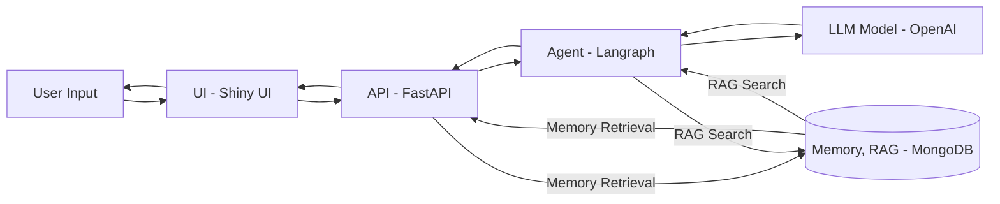

# Tax Agent

## This is an agent that utilizes augmented retrieval to search for the Taiwan import export tax categories by a given description of a product.

### Overview
An AI Agent capable of searching tax data to expedite users in finding the corresponding tax regulations for their products.

#### Scenario:
-  During the import declaration process, it is necessary to find the corresponding tax regulations for the imported products: https://fbfh.trade.gov.tw/fh/ap/listCCCf.do
-  However, the Trade Administration website only provides PDF downloads, and due to the large number of files, consolidating the content information is not easy. (In the early stages of importing, it is often impossible to determine with 100% accuracy the category to which the imported product belongs.)

#### Solution:
- To address the cumbersome steps involved in searching for tax regulations mentioned above, the Tax Agent employs a Retrieval-Augmented Generation (RAG) approach. It vectorizes the PDF content and uses semantic search; when a user provides a product description, the Tax Agent will identify the most likely matching tax category.

### 翻譯
```
能夠查找稅籍資料的AI Agent，加速使用者找到產品相對應的稅籍規則。

問題場景：
- 進貨報關時需要對進貨的產品找到相對應的稅籍規則：https://fbfh.trade.gov.tw/fh/ap/listCCCf.do
- 但貿易署網站只提供了pdf檔下載，且檔案數量多，內容資訊統整不易。（初期進貨往往無法100%確定進貨商品所屬類別）

解決方案：
- 為解決上述查找稅籍繁瑣步驟，Tax Agent 利用RAG的方式將pdf內容向量化並且用語意搜尋的方式，使用者提供產品描述，Tax Agent則會找出相對可能符合的稅籍類別。
```

## Architecture


## Resource
[Tax Category Source](https://fbfh.trade.gov.tw/fh/ap/listCCCf.do)


## Examples


