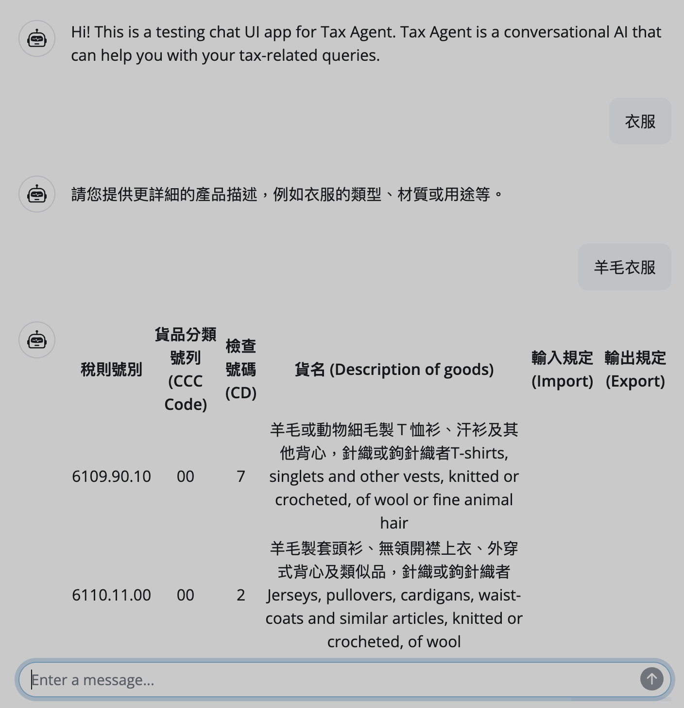
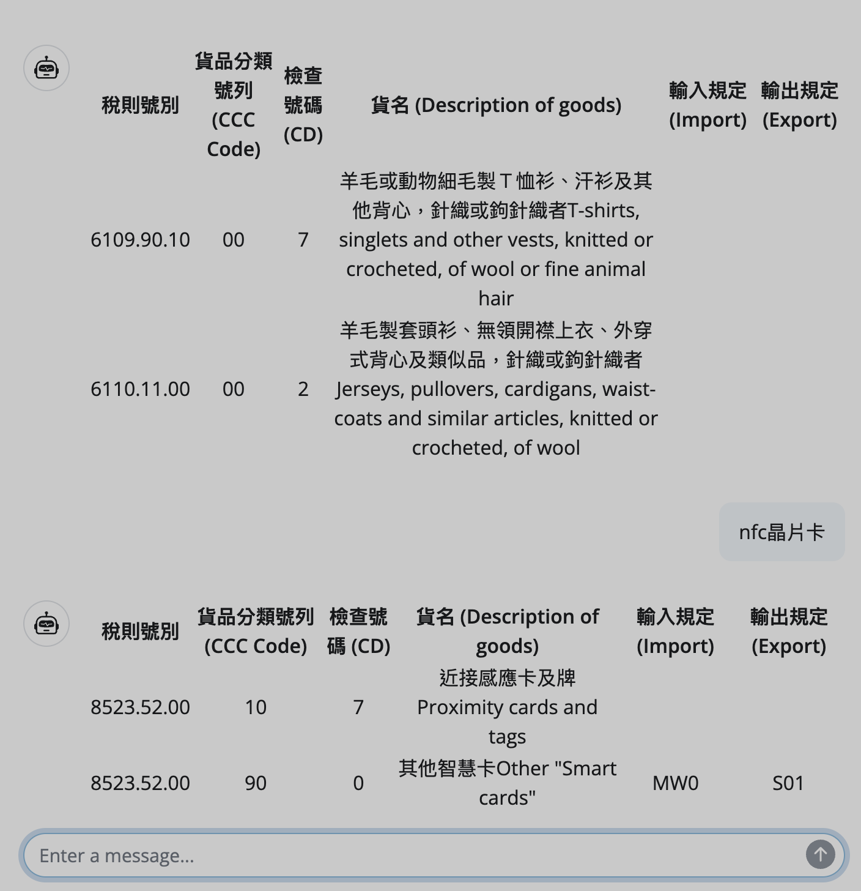
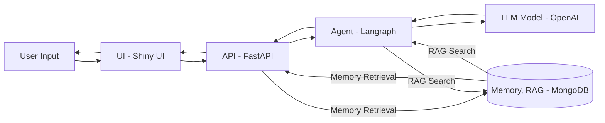

## Tax Agent

### This is an agent that utilizes augmented retrieval to search for the Taiwan import export tax categories by a given description of a product.

### Architecture

[Tax Category Source](https://fbfh.trade.gov.tw/fh/ap/listCCCf.do)